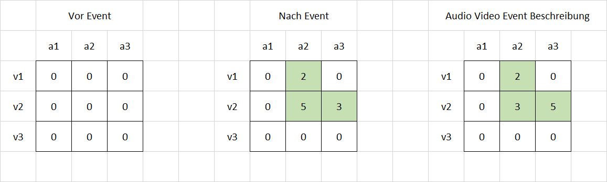
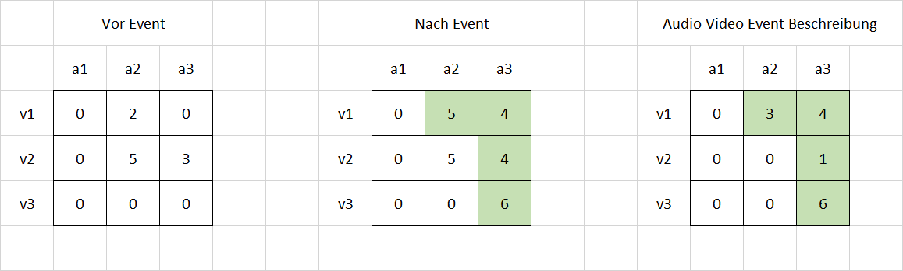

## Erkennung von audiovisuellen Events in Überwachungskameraaufnahmen 

Manuel Huber

+++

+++

---

## AVC-Matrix

Audio-Video-Concurrency - Matrix

+++?image=presentation/overview.png&size=auto 90%

+++?image=presentation/AVC-Coupling.png&size=auto 90%

+++

+++

+++?image=presentation/AVC-Example.png&size=auto 90%

---

## TAPPMOG

Time-Adaptive (Per-Pixel) Mixture Of Gaussians

+++

Ist die Gaußverteilung 
- ein Treffer:
  - Erhöhe Gewichtung, passe Mittelwert an, verringere Standardabweichung
  - Markiere Messwert als Vordergrund, wenn Summe der Gewichte > T 
- kein Treffer:
  - Verringere Gewichtung

+++ 
  
Ist keine Gaußverteilung ein Treffer:
- Markiere Messwert als Vordergrund
- Ersetze Gaußverteilung mit geringstem Gewicht
  
  
